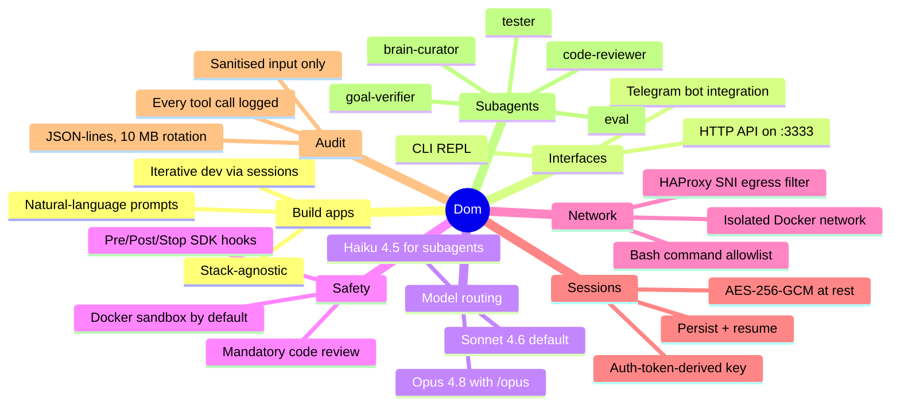
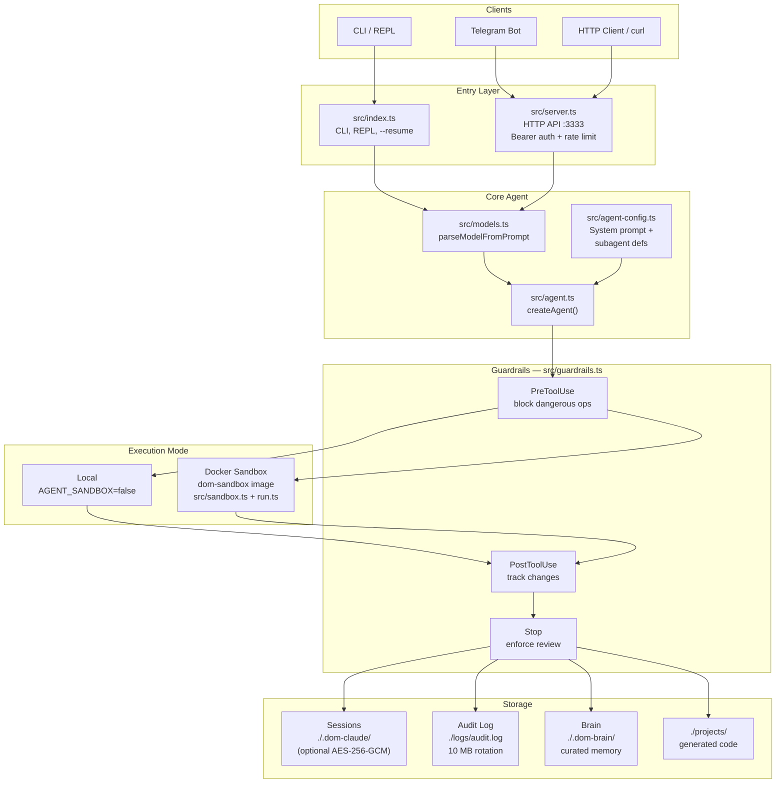
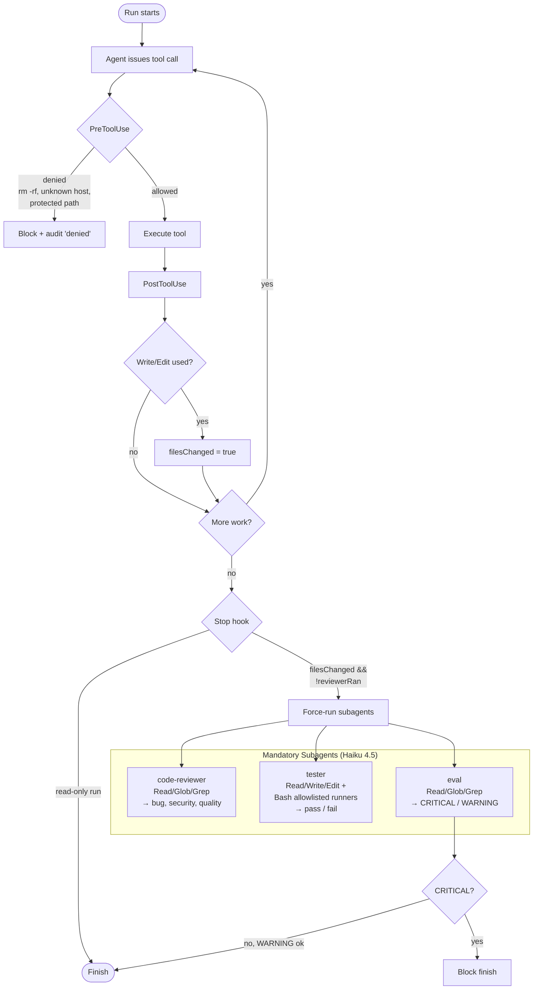
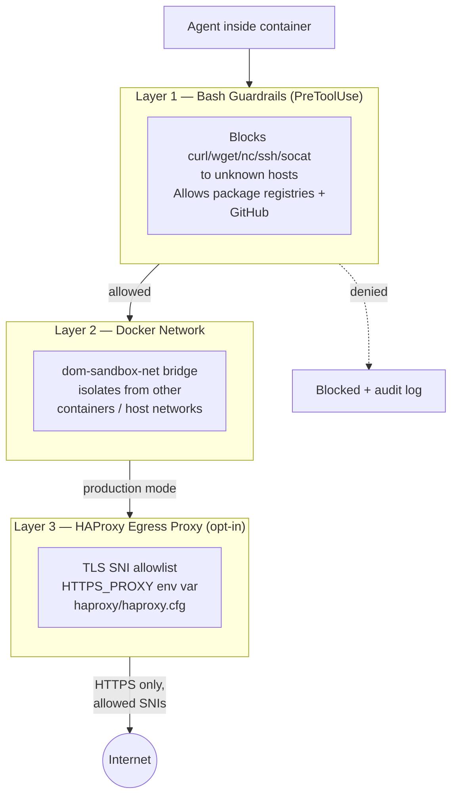
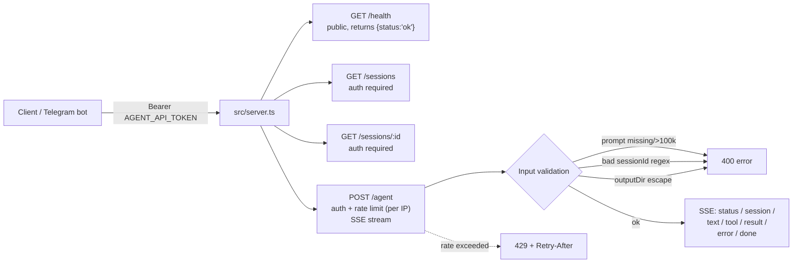

# Dom — Capabilities & Architecture

A visual overview of what Dom does and how the pieces fit together.
Each diagram is a Mermaid block — renders natively on GitHub, Notion, VS Code, Obsidian.

---

## 1. What Dom Can Do (capabilities mindmap)

---

## 2. System Architecture

End-to-end view: how a prompt flows from a client to executed code.

---

## 3. Hook Enforcement & Subagent Flow

The safety loop: how guardrails and subagents make Dom refuse to ship unreviewed code.

---

## 4. Defense-in-Depth: Network Security

Three independent egress layers — each catches what the others miss.

---

## 5. HTTP API Surface

Public-facing endpoints, auth, and validation.

---

## Talking Points (suggested for the presentation)

1. **What is Dom** — autonomous coding agent on top of `@anthropic-ai/claude-agent-sdk`, controllable from CLI, HTTP, or Telegram.
2. **Model routing** — cheap by default (Sonnet), powerful on demand (`/opus` → Opus 4.8), cheap-and-fast for review (Haiku).
3. **Safety story** — Docker sandbox + 3 hooks + mandatory review subagents. Code can't ship without `code-reviewer`, `tester`, and `eval` running.
4. **Defense in depth** — three independent network layers; each guards against a different failure mode.
5. **Operational hardening** — sessions encrypted at rest, audit log of every tool call, rate-limited HTTP API with bearer auth, TLS optional.
6. **Extensibility** — model routing + subagent definitions are stack-agnostic; new subagents (e.g. a security-auditor) can be added by extending `SUBAGENTS` in `agent-config.ts`.
