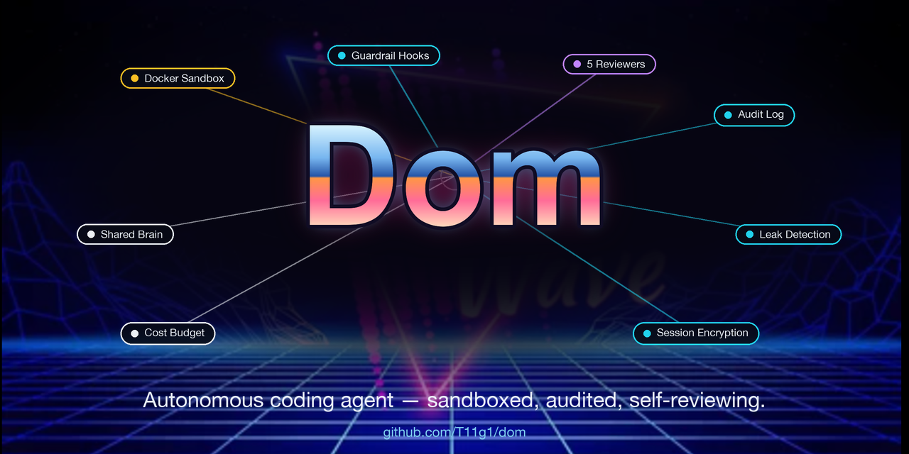
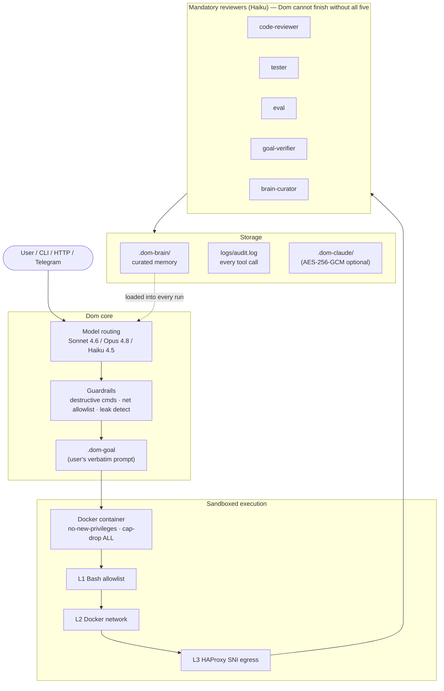

<p align="center">
  
</p>

<h1 align="center">Dom</h1>

<p align="center"><i>Autonomous coding agent that builds applications from natural language —<br/>sandboxed, audited, goal-tracking, and self-reviewing by design.</i></p>

<p align="center">
  <a href="https://github.com/T11g1/dom/actions/workflows/ci.yml"></a>
  <a href="LICENSE"></a>
  
  
  
</p>

---



---

## What is this?

**Dom** is an autonomous coding agent built on `@anthropic-ai/claude-agent-sdk`. You give it a natural-language prompt; it scaffolds the project, writes the code, runs tests, and self-reviews against your original goal — all inside a Docker sandbox with five layers of safety enforcement.

It's designed for people who want the productivity of an autonomous agent without surrendering operational control: every tool call is audited, every dangerous command is blocked, every generated file is scanned for embedded secrets, and the agent maintains a curated long-term memory you can `cat` and `git diff`.

## Why Dom is different

Most coding agents will happily embed secrets in source files, run destructive commands, or `fetch` whatever URL the model decides on. Dom won't.

| Feature | What it does |
|---|---|
| **Docker sandbox** | The agent runs inside a container with `--cap-drop ALL`, `no-new-privileges`, memory/CPU limits, and a dedicated bridge network. |
| **Guardrails (3 SDK hooks)** | `PreToolUse` blocks destructive Bash, non-allowlisted network hosts (incl. WebFetch), and Write/Edit content matching known secret patterns. `PostToolUse` tracks state. `Stop` refuses to finish without review. |
| **Goal persistence** | The user's original prompt is written to `.dom-goal` in the workspace. The main agent reads it first; the `goal-verifier` subagent reads it last to confirm the build actually satisfies the request. |
| **Five mandatory subagents** | `code-reviewer`, `tester`, `eval`, `goal-verifier`, `brain-curator` — all Haiku, all triggered by the Stop hook when files change or WebFetch runs. Dom literally cannot return a result without these passing. |
| **Shared brain** | A curated markdown memory bank (`./.dom-brain/`). Newest entries are loaded into every system prompt. The `brain-curator` decides what to save, overwrites contradicted memories, and tombstones dormant ones. Human-readable, `cat`-friendly, `git`-versionable. |
| **Three-layer network defense** | Bash-level command allowlist → isolated Docker bridge → opt-in HAProxy SNI egress proxy. Each layer catches what the others miss. |
| **Audit log** | JSON-lines log of every tool call (`./logs/audit.log`, 10 MB rotation, Bash command secrets redacted before write). |
| **Cost budget** | `AGENT_MAX_COST_USD` caps per-session spend. New runs on a budget-exceeded session are refused with `402`. |
| **HTTP API** | Bearer-auth, per-IP rate-limited, SSE streaming. Designed for a Telegram bot front-end but works with any HTTP client. |
| **Session encryption** | Optional AES-256-GCM bracket encryption for session files at rest. Key derived from `AGENT_API_TOKEN` via PBKDF2. |

---

## Quickstart

```bash
# 1. Install
git clone https://github.com/T11g1/dom.git
cd dom
npm install

# 2. Configure (copy and edit)
cp .env.example .env
#  - paste your ANTHROPIC_API_KEY
#  - generate a token:  openssl rand -hex 32  →  AGENT_API_TOKEN

# 3. Build the sandbox image (one-time)
npm run docker:build

# 4. Run interactively (Docker sandbox)
npm run dev

# ...or run the HTTP API on :3333
npm run serve

# ...or skip Docker for fast local dev
npm run dev:local
```

Inside the REPL, type a prompt:

```
> Build me a Fastify backend with health and metrics endpoints, in TypeScript.
```

Dom will scaffold the project, install dependencies, write code, run tests, dispatch all five reviewers, and write a brief summary. The user's prompt is preserved in `.dom-goal`; long-term lessons land in `.dom-brain/`.

---

## How it works (30 seconds)

1. You send a prompt (CLI, HTTP, or Telegram).
2. Dom routes to **Sonnet 4.6** (default), **Opus 4.8** (`/opus` prefix), or **Haiku 4.5** (subagents).
3. The prompt is persisted to `.dom-goal` so the agent can self-check.
4. The agent runs inside a Docker sandbox. Every tool call passes through guardrails (destructive-command regex, network host allowlist, Write/Edit secret scan).
5. When the agent thinks it's done, the **Stop hook** refuses to finish until five subagents have run: `code-reviewer`, `tester`, `eval`, `goal-verifier`, `brain-curator`.
6. The `brain-curator` saves any durable lessons from this session to `./.dom-brain/`. Future runs load these into the system prompt — that's how Dom gets smarter over time without re-learning.

---

## Architecture

```
src/
  agent.ts          Factory: createAgent() → local Query or Docker AsyncGenerator
  agent-config.ts   System prompt + 5 subagent definitions
  models.ts         Model routing (Sonnet/Opus/Haiku)
  guardrails.ts     PreToolUse + PostToolUse + Stop hooks (session-scoped state)
  sandbox.ts        Docker container + bridge network lifecycle
  run.ts            In-container entrypoint
  index.ts          CLI / REPL
  server.ts         HTTP API (bearer auth, rate limit, SSE)
  audit.ts          JSON-lines tool-call audit log
  leak-detect.ts    Shared secret-pattern library
  goal.ts           Persist .dom-goal in cwd
  brain.ts          Curated markdown memory bank
  budget.ts         Per-session cost cap
  session-crypt.ts  AES-256-GCM bracket encryption
  sessions.ts       SDK session list/resume wrapping
```

See [**OVERVIEW.md**](OVERVIEW.md) for diagrams of the architecture, hook-enforcement flow, and network defense layers. See [**CLAUDE.md**](CLAUDE.md) for the full spec (env vars, security model, edge cases).

---

## Subagents

| Name | Model | Job |
|---|---|---|
| `code-reviewer` | Haiku 4.5 | Bugs, security issues, type safety, best-practice deviations. |
| `tester` | Haiku 4.5 | Writes focused unit tests, runs them, reports pass/fail. Bash restricted to test runners. |
| `eval` | Haiku 4.5 | Guardrail bypasses, style violations, secrets-in-code. CRITICAL/WARNING. |
| `goal-verifier` | Haiku 4.5 | Reads `.dom-goal`; flags MISSING / WRONG / EXTRA features. |
| `brain-curator` | Haiku 4.5 | Saves/overwrites/evicts long-term memory. Write/Edit restricted to brain dir. |

All five are exact-name-matched at the Stop hook — a description like *"test the import path"* cannot satisfy `tester`.

---

## Configuration

Full list in [`.env.example`](.env.example). The most useful knobs:

| Variable | Default | Purpose |
|---|---|---|
| `ANTHROPIC_API_KEY` | _(required)_ | API authentication. |
| `AGENT_API_TOKEN` | _(required)_ | Bearer token for HTTP API auth. Generate with `openssl rand -hex 32`. |
| `AGENT_SANDBOX` | `true` | Docker mode on/off. |
| `AGENT_MODEL` | `claude-sonnet-4-6` | Default model. |
| `AGENT_MAX_TURNS` | `50` | Max agentic turns per run. |
| `AGENT_MAX_COST_USD` | _(empty)_ | Per-session USD cap. Empty = unlimited. |
| `AGENT_BRAIN_DIR` | `./.dom-brain` | Curated-memory location. |
| `AGENT_SESSION_ENCRYPT` | `false` | AES-256-GCM session-file encryption at rest. |
| `AGENT_RATE_LIMIT` | `10` | Requests/minute per IP on `POST /agent`. |
| `AGENT_TLS_CERT` / `_KEY` | _(empty)_ | Set both to serve HTTPS. |

---

## What's NOT in Dom

Honesty matters more than feature-checklists:

- **No iOS / Flutter / Android.** Dom is intentionally scoped to web + backend stacks (TS/JS/Python/Go/Rust/Ruby + server-side Swift on Linux). Mobile lives in a separate system.
- **No persistent learning across machines.** The brain is per-host. Sync via Dropbox / S3 / git if you need shared memory across teammates.
- **No vector store / RAG.** The brain is markdown by design. When you outgrow it (~200–500 entries), the migration path to a hybrid system is documented in `CLAUDE.md`.
- **No mid-run cost interrupt.** Budget is enforced at session boundaries (the current run finishes; the next is refused).
- **iOS-style code review patterns.** `code-reviewer`'s heuristics target web/backend bugs (memory leaks, type safety, missing error handling) — not Flutter widget rebuild patterns.

---

## Testing

```bash
npm run typecheck        # tsc --noEmit
npm test                 # 82 specs, ~300ms
```

Tests cover: every destructive-command regex, the WebFetch allowlist, Write/Edit leak detection, agent-id gating, session-state isolation, brain parsing + load-time leak defense + path traversal, audit redaction, encryption round-trip, budget enforcement, goal persistence.

---

## Security

- Docker isolation is the **primary** security boundary. The regex guardrails are defense-in-depth, not a replacement.
- Run with `AGENT_SANDBOX=true` in production. Always.
- The HTTP API requires `AGENT_API_TOKEN` (timing-safe compared). The server **refuses to start** if unset.
- See `CLAUDE.md` § "Security Notes" and § "Network Security" for the full threat model.

Found a security issue? Open a private security advisory on GitHub (Security tab → Report a vulnerability) rather than a public issue.

---

## Contributing

Contributions welcome. Before opening a PR:

1. `npm run typecheck && npm test` must pass.
2. New features should come with tests in `src/__tests__/`.
3. Touch `CLAUDE.md` if you change behavior described there.
4. Don't bypass guardrails to make tests pass; fix the guardrail.

For substantial changes, open an issue first so we can discuss approach.

---

## License

[MIT](LICENSE) © 2026 Rainer Tiigi
